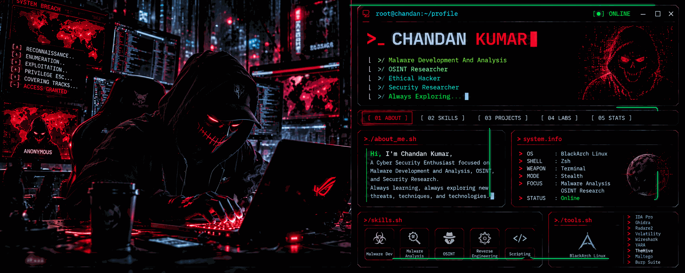

  

<table>
<tr>
<td align="center">

<h2>CHANDAN KUMAR</h2>

Cybersecurity Enthusiast • Malware Analysis • OSINT • Security Research

</td>
</tr>
</table>

 

<table>
<tr>
<td width="50%" valign="top">

<h3>01  ::  WHO AM I</h3>

I am a cybersecurity enthusiast focused on understanding modern security threats,
malware analysis, OSINT, reverse engineering, and practical security research.

I enjoy building security-focused tools, experimenting in controlled labs,
studying attack techniques, and exploring how defensive systems can be
strengthened against evolving threats.

</td>

<td width="50%" valign="top">

<h3>02  ::  CURRENT STATUS</h3>

<table>
<tr>
<td>STATUS</td>
<td>🟢 ACTIVE</td>
</tr>

<tr>
<td>FOCUS</td>
<td>Cybersecurity Research</td>
</tr>

<tr>
<td>PRIMARY</td>
<td>Malware Analysis</td>
</tr>

<tr>
<td>RESEARCH</td>
<td>OSINT</td>
</tr>

<tr>
<td>ENVIRONMENT</td>
<td>BlackArch Linux</td>
</tr>

<tr>
<td>MODE</td>
<td>Always Learning</td>
</tr>
</table>

</td>
</tr>
</table>

<h2>⚡ AREAS OF FOCUS</h2>

<table>
<tr>

<td align="center">
🦠
 
<strong>Malware Analysis</strong>
 
Reverse Engineering
</td>

<td align="center">
🔎
 
<strong>OSINT</strong>
 
Digital Investigation
</td>

<td align="center">
🛡️
 
<strong>Security Research</strong>
 
Threat Research
</td>

<td align="center">
🌐
 
<strong>Web Security</strong>
 
Application Security
</td>

</tr>

<tr>

<td align="center">
📡
 
<strong>IoT Security</strong>
 
Device Research
</td>

<td align="center">
🤖
 
<strong>AI Security</strong>
 
Security Automation
</td>

<td align="center">
🔬
 
<strong>Reverse Engineering</strong>
 
Binary Analysis
</td>

<td align="center">
💻
 
<strong>Security Tooling</strong>
 
Research Projects
</td>

</tr>
</table>

<h2>🧰 SECURITY TOOLKIT</h2>

<table>
<tr>
<td><strong>Operating Systems</strong></td>
<td>BlackArch Linux • Linux • Windows</td>
</tr>

<tr>
<td><strong>Programming</strong></td>
<td>Python • Bash • PowerShell</td>
</tr>

<tr>
<td><strong>Analysis</strong></td>
<td>Ghidra • IDA Pro • Radare2 • Volatility</td>
</tr>

<tr>
<td><strong>Network</strong></td>
<td>Wireshark • Nmap</td>
</tr>

<tr>
<td><strong>Security</strong></td>
<td>Burp Suite • Metasploit</td>
</tr>

<tr>
<td><strong>Shell</strong></td>
<td>Zsh • Bash</td>
</tr>

<tr>
<td><strong>Research</strong></td>
<td>OSINT • Malware Analysis • Reverse Engineering</td>
</tr>
</table>

<h2>🚀 WHAT I'M BUILDING</h2>

<table>
<tr>
<td align="center">🔬 Security Research Projects</td>
<td align="center">🦠 Malware Analysis Workflows</td>
<td align="center">🔎 OSINT Utilities</td>
</tr>

<tr>
<td align="center">🤖 AI Security Tools</td>
<td align="center">⚙️ Security Automation</td>
<td align="center">📡 IoT Security Research</td>
</tr>
</table>

<h2>📂 RESEARCH INTERESTS</h2>

<strong>Malware Research</strong>

 

Analysis of malicious software, behavior patterns, persistence concepts,
reverse engineering workflows, and controlled laboratory research.

 

<strong>OSINT Research</strong>

 

Open-source intelligence techniques, information gathering,
digital footprint research, and investigation workflows.

 

<strong>Security Research</strong>

 

Studying vulnerabilities, security architecture, defensive mechanisms,
application security, and practical research methodologies.

 

<strong>AI + Cybersecurity</strong>

 

Exploring how AI can assist security research, analysis, automation,
knowledge discovery, and cybersecurity workflows.

<h2>🧠 LEARNING MODE</h2>

<table>
<tr>
<td align="center">
🔴 Malware Analysis
</td>

<td align="center">
🔵 Reverse Engineering
</td>

<td align="center">
🟢 OSINT
</td>

<td align="center">
🟣 AI Security
</td>
</tr>
</table>

 

<code>LEARN → RESEARCH → BUILD → ANALYZE → IMPROVE</code>

<h2>📊 GITHUB ACTIVITY</h2>

  

<h2>☠️ TERMINAL</h2>

<table>
<tr>
<td>

<code>
root@chandan:~$ whoami
</code>

 

<code>
cybersecurity_researcher
</code>

  

<code>
root@chandan:~$ status
</code>

 

<code>
[ ONLINE ] [ LEARNING ] [ RESEARCHING ] [ BUILDING ]
</code>

  

<code>
root@chandan:~$ ./next_target.sh
</code>

 

<code>
Always Exploring...
</code>

</td>
</tr>
</table>

<h3>⚠️ SECURITY IS A JOURNEY, NOT A DESTINATION</h3>

Learning. Researching. Building. Repeating.

 

